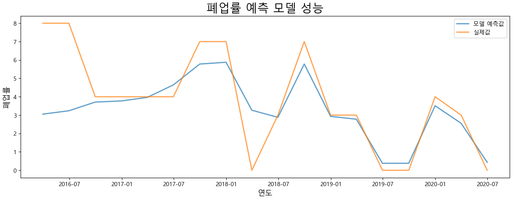
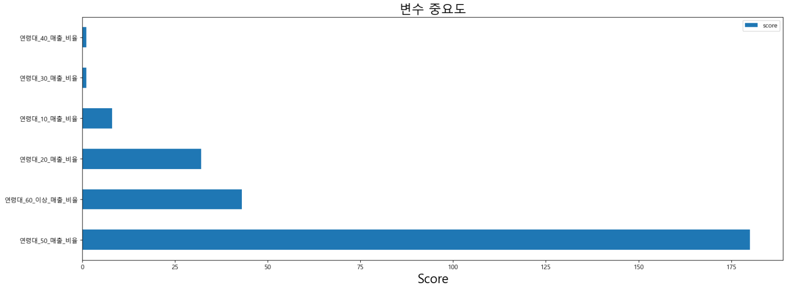
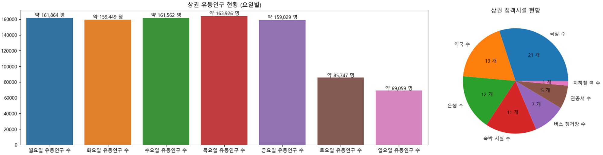

# 예비 창업자를 위한 상권 분석 시스템

**2020년 2학기 오픈소스 소프트웨어 프로젝트** (SCS-4045)

프로젝트 저장소: [2020-2-OSSP-3P-1](https://github.com/CSID-DGU/2020-2-OSSP-3P-1)  

자세한 내용은 ```src/presentation.pdf``` 참고

## 프로젝트 배경
### (1) 생계형 창업의 증가
- 최근 노년층의 정년퇴직 시기가 빨라지고 청년들의 취업난이 심해짐에 따라 창업을 통해 자신만의 사업을 계획하는 사람들이 늘어나고 있음
- 우리나라의 창업 유형은 주로 ‘생계형 창업’에 해당
- 생계형 창업이란 도∙소매업과 숙박∙외식업 등 부가가치는 낮지만 진입장벽이 낮아 쉽게 시작할 수 있는 업종을 바탕으로 한 창업을 의미

### (2) 생계형 창업의 실패 위험과 상권 분석의 중요성
- 2018년 중소벤처기업부의 자료에 의하면 주로 생계형 창업에 해당하는 숙박∙외식업과 도∙소매업의 2년차 생존률은 각각 42.3%와 45.4%에 불과하였고, 5년차 생존률은 각각 17.9%와 24.2%에 불과
- 생계형 창업의 생존 가능성을 높이기 위해서는 창업 전 철저한 사전준비가 필요
- 생계형 창업은 진입장벽이 낮아 쉽게 접근할 수 있다는 장점을 갖지만 이는 반대로 누구나 쉽게 유사한 업종을 개업하고 운영할 수 있다는 것을 의미
- 경쟁 속에서 생계형 창업이 성공하기 위해서는 철저한 상권 분석을 바탕으로 다른 업체들과 차별화된 전략을 설정하여 경쟁 우위를 확보하고, 보다 유리한 입지를 선정할 필요가 있음
- 하지만 이러한 상권분석은 실제로 잘 이루어지지 않음
- 2019년 통계청의 조사에 따르면 당해 기준 1년 이내에 사업을 시작한 자영업자 중 준비기간이 1~3개월 미만인 비중이 전체의 약 52.3%에 달하여 많은 창업자들이 철저한 준비 없이 바로 창업에 뛰어든다는 점을 시사

## 프로젝트 목표
***"공공 데이터를 활용하여 창업 예정자들의 성공적 창업을 돕는 상권 분석 모델 개발"***
- 창업 예정자의 성공적인 창업을 돕는 상권 분석 모델을 도출
- 창업 예정자들은 해당 모델을 사용하여 상권 분석 정보를 쉽게 획득할 수 있음과 동시에 창업 최적 입지를 선정하고 운영 전략을 설정하는 데에 해당 정보를 사용할 수 있음
- 창업 예정자의 성공적인 창업을 지원하며 거시적으로는 활발한 창업 생태계를 조성하고 시장 경제 활성화에 기여

## 개발내용
### (1) 데이터 수집 및 전처리
- [서울 열린데이터 광장](http://data.seoul.go.kr/)에서 서울시 상권 데이터 수집
- 연도별, 항목별로 분리되어 있는 데이터를 상권 정보와 세부 업종에 관한 데이터로 통합
- 결측치 처리 및 모델 학습을 위한 전처리(*e.g.* 원-핫 인코딩, 정규화) 수행

### (2) 모델링
- XGBoost 모델을 기반으로 하는 두 개의 예측 모델 개발

#### a. 폐업률 예측 모델
- 창업 예정자가 창업 위험도를 사전에 확인해볼 수 있도록 특정 업종의 상권 내 폐업률을 예측하는 **폐업률 예측 모델** 개발
- 특정 상권 내 업종의 과거 1년 동안의 데이터를 사용하여 해당 업종의 다음 분기 폐업률을 예측

<p align="center">
    
</p>

#### b. 창업 전략 분석 모델
- ’폐업률’과 반대되는 개념인 ‘생존율’을 예측하여 창업 예정자에게 특정 업종이 상권 내에서 생존하는 데 필요한 정보를 제공하기 위한 **창업 전력 분석 모델** 개발
- 창업 전력 분석 모델은 직전 분기 특정 업종 데이터를 기반으로 다음 분기의 업종 생존율을 예측
- 변수 카테고리별 중요도를 확인하기 위해 업종 매출 데이터를 ‘연령별 매출’, ‘시간대별 매출’, ‘성별 매출’, ‘요일별 매출’로 구분하여 각각 모델링 진행
- 변수 중요도를 도출하고 시각화하여 창업 예정자로 하여금 창업 이후 생존에 필요한 요인이 무엇인지 파악할 수 있도록 함

<p align="center">
    
</p>

### (3) 시각화
- 상권 기초 통계 시각화 수행
- 창업 전략 분석 결과 시각화 수행

<p align="center">
    
</p>

## 사용법
- [구글드라이브](https://drive.google.com/drive/folders/1V9okDk4UEJL9BMSpnO59PRy8_LNyfCpW?usp=drive_link)에서 데이터 다운로드 후 ```data``` 폴더에 저장
- ```main.ipynb```에서 순차적으로 셀 실행

## 레퍼런스
- [2020-2-OSSP-3P-1](https://github.com/CSID-DGU/2020-2-OSSP-3P-1)
